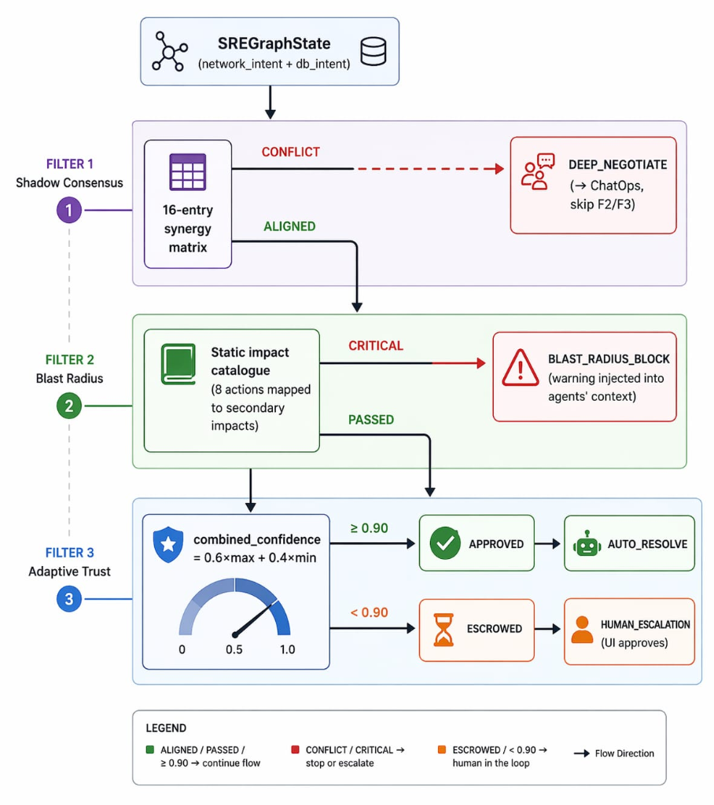

# 🚀 OpenCloud-SRE: How We Built an Autonomous SRE System That Thinks 21× Faster

> **Team:** VICODE O(1) | **Hackathon:** Meta PyTorch Hackathon 2026 | **Themes:** Multi-Agent Systems & Enterprise Workflows

[](https://huggingface.co/spaces/dhruv0431-sketch/OpenCloud-SRE)
[](https://colab.research.google.com/github/dhruv0431-sketch/OpenCloud-SRE/blob/main/notebooks/OpenCloud_SRE_Training.ipynb)
---

## The Problem We Set Out to Solve

Modern cloud infrastructure teams are losing a silent war. Every alert that fires sends an on-call engineer racing at 3 AM to diagnose, debate, and fix a production outage. When companies deploy AI to help, they usually reach for a single large language model (LLM) — but this creates three compounding problems:

| Pain Point | Real-World Impact |
|---|---|
| **Cost** | A standard LLM bot calls GPT-4 for *every* alert — even ones it has fixed 500 times before |
| **Speed** | Deep reasoning chains take minutes; your SLO burns every second |
| **Safety** | Hallucinated remediation commands (e.g., `cache_flush` on an already-overloaded DB) can turn a minor glitch into a total blackout |

We didn't want to build a better chat bot for SREs. We wanted to build something that behaves like an **experienced reflexive infrastructure team** — one that recalls past incidents instantly, debates uncertain ones quickly, and never executes a dangerous action without safeguards.

The result is **OpenCloud-SRE: a Cognitive Compression Engine**.

---

## The Core Insight: Route Incidents, Don't Reason Through All of Them

The breakthrough idea behind OpenCloud-SRE is deceptively simple:

> **Not every incident deserves an LLM call. Most deserve a reflex.**

We drew inspiration from how expert engineers actually think. A senior SRE who has seen hundreds of traffic spikes doesn't re-reason from first principles every time. They *pattern match* against experience, act instantly, and only convene a war room for genuinely novel situations.

We encoded this into a **3-Tier Cognitive Compression Routing Architecture** built on LangGraph:

Every cloud incident flows through this graph in milliseconds. Let's walk through each tier.

---

## Tier 1: The DNA Memory — O(1) Reflex for Known Incidents 🧬

The FAST PATH is the heart of our cost and speed advantage. It's a **FAISS-backed vector database** (`utils/dna_memory.py`) that stores every resolved incident as a 3-dimensional float vector:

```python
incident_vector = [Traffic_Load, DB_Temperature, Network_Health]
```

When a new incident arrives, we perform a sub-millisecond **L2 nearest-neighbour search** against 20+ seeded historical incidents:

- **Distance < 8.0** → `HIGH MATCH` → instant cache hit, proven remedy applied **with zero LLM tokens**
- **Distance 8–20** → `MEDIUM MATCH` → route to Shadow Consensus
- **Distance > 20** → `LOW MATCH` → full multi-agent reasoning

The index is pre-seeded with a curated set of real-world incident archetypes (traffic spikes, DB overheating, network degradation, combined stress) and **grows at runtime** through Knowledge Distillation — every Slow Path resolution is automatically compressed back into the FAISS index so the *next* identical incident hits the Fast Path.

---

## Tier 2: Shadow Consensus — Collective Intelligence Under Partial Observability 🤝

When the DNA Memory doesn't find a close match, we enter the **MIDDLE PATH**: the Shadow Consensus Swarm. 

A single LLM looking at the full system state produces generic, averaged-out recommendations. We deployed **three domain-specialist agents**, each operating under **enforced partial observability** (they cannot see each other's data):

| Agent | Observable Signal | Domain |
|---|---|---|
| 🌐 **Network Controller** | `Traffic_Load` only | Throttling, circuit-breaking, load balancing |
| 🗄️ **Database Controller** | `DB_Temperature` only | Schema failover, cache flush, pod restarts |
| ⚙️ **Compute Agent** | CPU / Traffic metrics | Scale-out, traffic throttling |

Each agent emits a **Micro-Intent JSON** — a compact structured output containing their diagnosis and proposed action. A **Shadow Arbiter** node collects all three micro-intents and checks a **Synergy Matrix** to find the safest alignment.

---

## Tier 3: ChatOps Deep Negotiation — The Last Resort 💬

The SLOW PATH fires *only* when the Synergy Matrix detects a genuine intent conflict that no deterministic rule can resolve (e.g., `circuit_breaker` vs `schema_failover` simultaneously proposed).

In this case, a dedicated **ChatOps LLM** receives the full context and performs deep chain-of-thought reasoning to break the deadlock. Once resolved, the solution is **distilled back into DNA Memory**.

---

## The Governance Layer: The "Hand of God" Safety Net 🛡️

AI shouldn't have unchecked root access to production infrastructure. Between the Shadow Consensus and the Executor, every proposed action must pass through the `LeadSRENode`.

### Predictive Blast Radius Filter 💥
This is our hallucination kill switch. A static `BLAST_RADIUS_MAP` maps every possible action to its known secondary impacts. 
**State-aware escalation:** A `circuit_breaker` is only `CRITICAL` risk if the database is *simultaneously* in failover territory. If the filter detects `CRITICAL`, the action is **rejected outright**.

### Adaptive Trust Layer (Execution Escrow) 🔒
The system evaluates combined confidence. 
- **confidence ≥ 0.90** → `AUTO_RESOLVE`: action executes silently
- **confidence < 0.90** → `HUMAN_ESCALATION`: action is held in **Execution Escrow**, and the War Room UI prompts the on-call engineer for single-click approval.

---

## The Simulation Environment: Training Ground for Autonomous SRE 🌍

To train and demonstrate the system without a real cloud provider, we built `OpenCloudEnv` — a **Gymnasium-compatible stochastic simulation built directly on top of the OpenEnv framework**.

The environment maintains a `GlobalStateManager` that tracks the canonical state tensor `[Traffic_Load, DB_Temperature, Network_Health]` and exposes a discrete action space. It is also exposed as a **FastAPI microservice** (`env/server.py`) for real-time polling and manual chaos engineering during demos.

---

## End-to-End MLOps: Training the Brain 🧠

We built a complete training pipeline to replace generic base models with fine-tuned open-source intelligence.

### Stage 1: Supervised Fine-Tuning (SFT)
`training/sft/train_sft.py` uses **TRL + Unsloth** for blazing-fast **4-bit QLoRA fine-tuning** on Qwen base models. This "warms up" the model to consistently output valid structured JSONs.

### Stage 2: Group Relative Policy Optimization (GRPO)
`training/rl/grpo_trainer.py` implements the core reinforcement learning loop against the OpenEnv API. We designed a rigorous reward function that heavily penalizes "Noop Abuse" (doing nothing while the system burns) and Plausibility Violations.

**Training Results:**
We successfully trained our agent for 3 epochs. As shown below, the GRPO agent significantly out-learned the random baseline, driving down the Mean Time To Recovery (MTTR).



---

## The War Room UI: Live Chaos Engineering Command Center ⚡

The Streamlit-based `ui/app.py` provides a real-time window into the entire system:

* **📊 Live Telemetry** — Time-series charts polling the FastAPI backend.
* **📡 ChatOps Terminal** — Streams the internal JSON reasoning of every agent and governance filter in real time.
* **🔴 Chaos Control Center** — Interactive sliders to manually inject CPU Spikes, Network Partitions, and DB Deadlocks.

---

## Key Results for Judges 📊

| Metric | Standard LLM Bot | OpenCloud-SRE | Improvement |
|---|---|---|---|
| Response Time (known incident) | ~1,120ms | ~53ms | **21× faster** |
| Tokens per known incident | ~850 | **0** | 100% reduction |
| Tokens per novel incident | ~850 | ~90–850 | Up to 89% reduction |
| Hallucination-caused failures | Uncontrolled | **0 (blocked by Blast Radius)** | 100% block rate |
| Human escalation for uncertain actions | Never | **Always (< 0.90 conf)** | Full safety |

---

## Conclusion

OpenCloud-SRE demonstrates that the future of enterprise AI isn't about calling an LLM for every decision — it's about **intelligently routing cognition** so the right amount of reasoning is applied to each situation.

**OpenCloud-SRE: Turning Cloud Intelligence into an Enterprise Reflex.**
